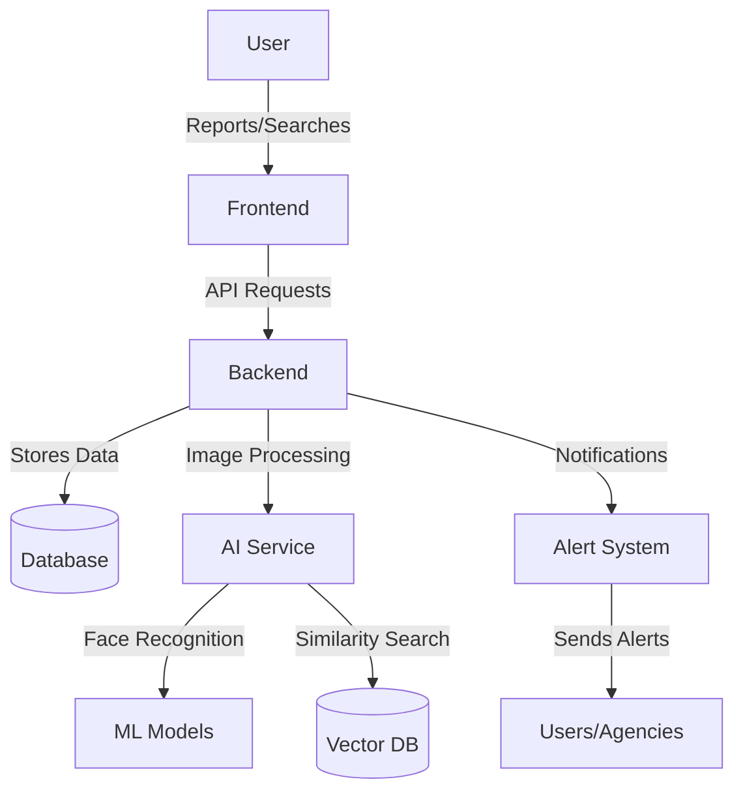
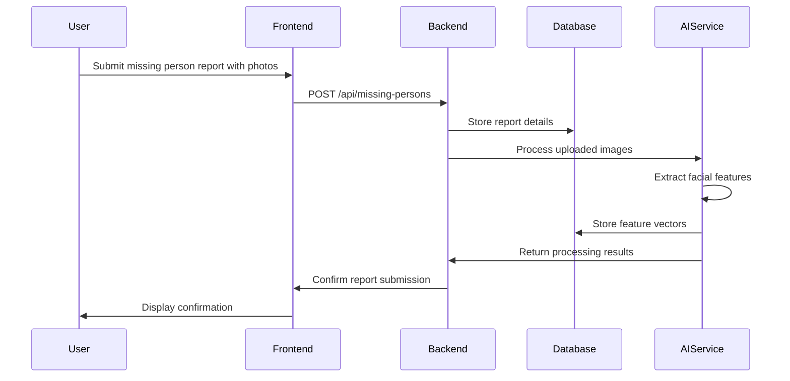
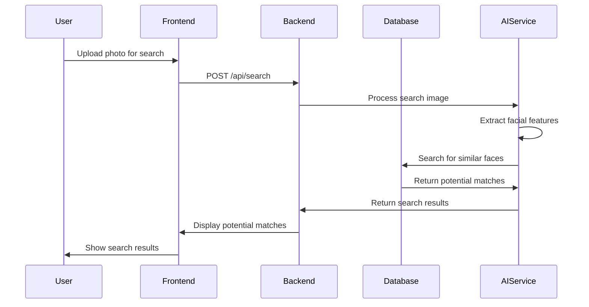
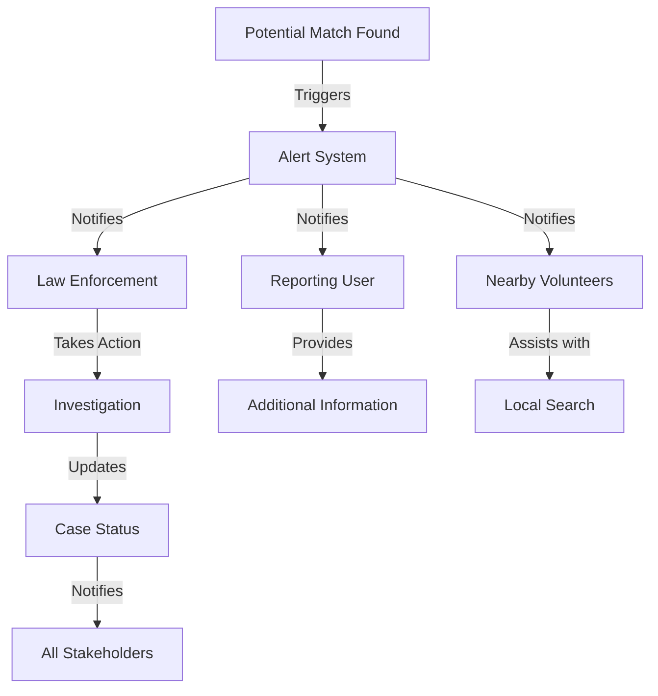

# ABSENS - AI-Based System for Efficiently Notifying and Searching

## 📑 Overview

ABSENS is a comprehensive platform developed to help locate and reunite missing individuals using advanced AI technology. The system leverages facial recognition, age progression technology, and a nationwide network of volunteers and law enforcement agencies to create a robust solution for finding missing persons.

By combining cutting-edge technology with a user-friendly interface, ABSENS aims to streamline the process of reporting, searching for, and identifying missing individuals across India.

## ✨ Key Features

- **🔍 AI-Powered Recognition**: State-of-the-art facial recognition and age progression technology for accurate identification
- **🔔 Real-time Alerts**: Instant notifications for potential matches and sightings across the country
- **💾 Centralized Database**: Comprehensive repository of missing person reports with advanced search capabilities
- **👥 Volunteer Network**: Nationwide network of verified volunteers and organizations working together
- **👮 Law Enforcement Integration**: Secure connection with police and agencies across India
- **📱 Responsive Design**: Fully responsive interface that works seamlessly on all devices
- **🌙 Dark Mode Support**: Complete dark mode implementation for better accessibility and reduced eye strain
- **🔒 Secure Authentication**: Robust user authentication and authorization system

## 🛠️ Tech Stack

### Frontend
- **Framework**: Next.js 14 (React)
- **Language**: TypeScript
- **Styling**: Tailwind CSS with custom UI components
- **State Management**: Redux Toolkit
- **Authentication**: JWT with secure token refresh

### Backend
- **API Server**: Node.js with Express
- **Database**: MongoDB
- **Authentication**: JWT, bcrypt for password hashing
- **Validation**: Joi/Zod

### AI/ML Services
- **Image Processing**: FastAPI
- **Facial Recognition**: DeepFace
- **Embedding Models**: Google's Embedding Model
- **Vector Database**: For efficient similarity search

## 🚀 Getting Started

### Prerequisites

Before you begin, ensure you have the following installed:
- Node.js (v18.0.0 or higher)
- npm (v9.0.0 or higher) or yarn (v1.22.0 or higher)
- MongoDB (v6.0 or higher)
- Python 3.9+ (for AI services)

### Installation

1. **Clone the repository**

```bash
git clone https://github.com/your-organization/absens.git
cd absens
```

2. **Set up the Frontend**

```bash
# Navigate to the Frontend directory
cd Frontend

# Install dependencies
npm install
# or
yarn install

# Create a .env.local file with the following content
echo "NEXT_PUBLIC_BACKEND_URL=http://localhost:5000
NEXT_PUBLIC_IMAGE_RECOGNITION_URL=http://localhost:8000" > .env.local
```

3. **Set up the Backend**

```bash
# Navigate to the Backend directory
cd ../Backend

# Install dependencies
npm install
# or
yarn install

# Create a .env file with the following content
echo "PORT=5000
MONGODB_URI=mongodb://localhost:27017/absens
JWT_SECRET=your_jwt_secret_key
JWT_EXPIRES_IN=7d" > .env
```

4. **Set up the AI Service (if applicable)**

```bash
# Navigate to the AI-Service directory
cd ../AI-Service

# Create and activate a virtual environment
python -m venv venv
source venv/bin/activate  # On Windows: venv\Scripts\activate

# Install dependencies
pip install -r requirements.txt
```

### Running the Application

1. **Start the Frontend**

```bash
cd Frontend
npm run dev
# or
yarn dev
```

2. **Start the Backend**

```bash
cd Backend
npm run dev
# or
yarn dev
```

3. **Start the AI Service (if applicable)**

```bash
cd AI-Service
python app.py
```

The application will be available at:
- Frontend: http://localhost:3000
- Backend API: http://localhost:5000
- AI Service: http://localhost:8000

## 📂 Project Structure

```
absens/
├── Frontend/               # Next.js frontend application
│   ├── app/                # Next.js app directory (pages and layouts)
│   ├── components/         # Reusable UI components
│   │   ├── ui/             # Base UI components
│   │   └── layout/         # Layout components
│   ├── lib/                # Utility functions and state management
│   │   ├── slices/         # Redux slices
│   │   └── store.ts        # Redux store configuration
│   └── public/             # Static assets
│
├── Backend/                # Node.js backend application
│   ├── controllers/        # Request handlers
│   ├── models/             # Database models
│   ├── routes/             # API routes
│   ├── middleware/         # Custom middleware
│   └── utils/              # Utility functions
│
└── AI-Service/             # Facial recognition service
    ├── models/             # ML models
    ├── api/                # FastAPI endpoints
    └── utils/              # Utility functions
```

## 🔐 Authentication Flow

ABSENS implements a secure authentication system using JWT (JSON Web Tokens):

1. User registers or logs in through the frontend
2. Backend validates credentials and issues a JWT and refresh token
3. Frontend stores the tokens securely
4. JWT is included in the Authorization header for protected API requests
5. When the JWT expires, the refresh token is used to obtain a new JWT
6. Backend middleware validates the JWT for protected routes

## 🌐 API Endpoints

### Authentication
- `POST /api/auth/register` - Register a new user
- `POST /api/auth/login` - Login and receive JWT
- `POST /api/auth/refresh` - Refresh JWT token
- `POST /api/auth/logout` - Invalidate tokens

### Missing Persons
- `POST /api/missing-persons` - Report a missing person
- `GET /api/missing-persons` - Get all missing persons
- `GET /api/missing-persons/:id` - Get a specific missing person
- `PUT /api/missing-persons/:id` - Update a missing person report
- `DELETE /api/missing-persons/:id` - Delete a missing person report

### Search
- `POST /api/search` - Search for missing persons with optional image upload
- `GET /api/search/results/:id` - Get search results

## 🧪 Testing

```bash
# Run frontend tests
cd Frontend
npm test
# or
yarn test

# Run backend tests
cd ../Backend
npm test
# or
yarn test
```

## 🚢 Deployment

### Docker Deployment

A `docker-compose.yml` file is provided for easy deployment:

```bash
# Build and run with Docker Compose
docker-compose up -d
```

### Manual Deployment

#### Frontend
```bash
cd Frontend
npm run build
npm start
```

#### Backend
```bash
cd Backend
npm run build
npm start
```

## 🤝 Contributing

We welcome contributions to ABSENS! Please follow these steps:

1. Fork the repository
2. Create a feature branch (`git checkout -b feature/amazing-feature`)
3. Commit your changes (`git commit -m 'Add some amazing feature'`)
4. Push to the branch (`git push origin feature/amazing-feature`)
5. Open a Pull Request

Please ensure your code follows our coding standards and includes appropriate tests.

## � System Workflow Diagrams

### Overall System Architecture



### Missing Person Report Flow



### Search Process Flow



### Alert Notification Flow

